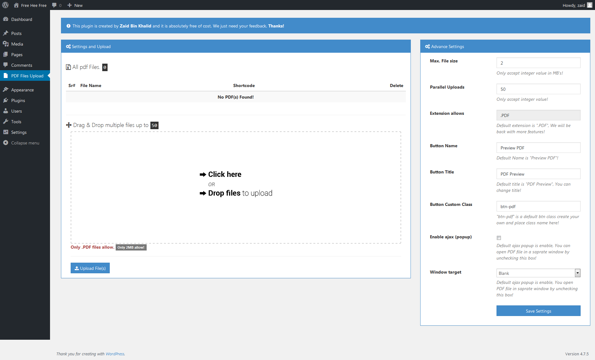

# PDF-POPUP-VIEWER (WP PLUGIN) 
PDF POPUP VIEWER is a very simple plugin with and without POPUP. 

# Composer & Manual Installation

1) You can install this plugin using composer use below command to install it.

`composer require learncodeweb/pdf-popup-viewer-wp:dev-master`

2) There are two manual process listed below.

1. Zip upload directly
    
    a) Download the source  code from GitHub.    
    b) Go to the WP admin panel and find menu Plugin.    
    c) Click on Add New you will see the Upload Plugin on Top.    
    d) Click on the Upload Plugin and Choose the Zip file that you downloaded form GitHub and upload.
    e) After uploading activate the plugin and done.

2. You can install this plugin manually
    
    a) Download the source code from GitHub.    
    b) Extract the files in any local folder.    
    c) The inside folder of downloaded zip will be PLUGIN-NAME-master.    
    d) Rename the inside folder PLUGIN-NAME-master to PLUGIN-NAME. [You just need to remove the last **-master**].    
    e) Copy and paste folder into the plugins DIR the complete path of Plugin Dir is wp-content->Plugins->PASTE YOUR PLUGIN.    

  1. Download this plugin and just remove the <strong>(-master)</strong> at the end of the ZIP FILE name.
  2. Add plugin via WP plugin add method.
  3. Active this plugin. After activation you can see the PDF Files Upload btn.
  4. It is very simple to upload PDF files. You just need to drag and drop or select files from computer.
  5. On your right side there are some options that are set by default. You can change these options if you want.
  6. You can test POPUP viewer only on a live envoirment.

Thanks to

<a href="http://www.dropzonejs.com/">DROPZONE JS</a>
